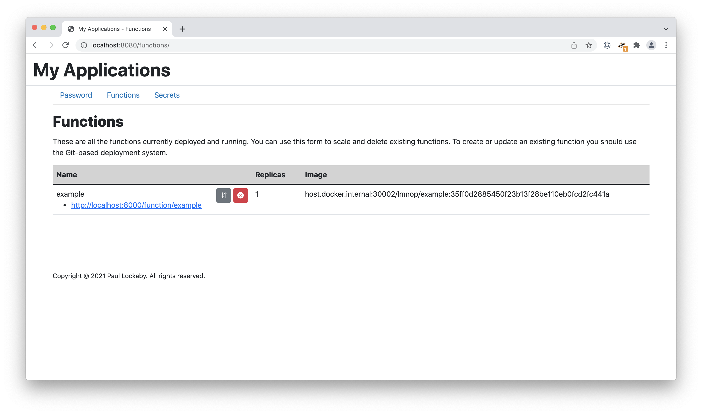

# lmnop - The system for deploying functions.

lmnop, pronounced "limb-nop", is a system for deploying functions using a Heroku-like git-push interface. lmnop uses [OpenFaaS](https://www.openfaas.com/) to manage deployments. You choose a template, you build some code to match the template, and then you git-push it to lmnop and it will either deploy a new function or replace an existing function.

## Requirements

This system requires:

* Kubernetes
* PostgreSQL
* A configured container registry where you can push and pull into your Kubernetes cluster
* A configured web server with authentication in front of it to protect the portal
* Optional: a wildcard domain that you can use to access your functions

## Caveat

This system is not meant to be used by multiple users who do not trust each other. It expects that everyone using it knows and trusts everyone else.

## Components

### portal

This is a view into the functions that you are running. It is expected that you will protect this portal with some authentication scheme. It lists the functions that have been deployed and allows you to scale them or delete them. It also offers an interface to set a deployment password and to add secrets that would be available to your functions.



### builder

The builder is the component that takes your code and deploys it. It runs a web server that you can git-push to and it will build a new deployment out of your git-push. Every time you push it will update a git repository and build a new deployment using a git prereceive hook.


The second part of the builder is a window into the repositories that have been built using the basic gitweb interface.


### router

The router is an optional component that can be used to listen for wildcard domain requests and forward them to the correct function. For example, if you set up a wildcard DNS entry for `*.apps.example.com` and have the router listen to that address then requests to `example.apps.example.com` will be sent to the function called `example`. Otherwise, functions are usually accessible at something like `example.com/function/example`.

# Example Deployment

This example directory will get your entire `lmnop` system running on your local system with a few easy steps.

## Prerequisites

In order to get started you will need:

* Docker Desktop for macOS or Windows
* Kubernetes enabled within Docker Desktop
* Modify the Docker Engine configuration to add this:

```json
{
  "insecure-registries": [
    "host.docker.internal:30002"
  ]
}
```

## Starting Up Kubernetes Components

The `lmnop` system uses [OpenFaaS](https://www.openfaas.com/) to manage and deploy functions. OpenFaaS works really well with Kubernetes and we want to use it with Kubernetes. So go to the `example/openfaas` directory and install the necessary containers:

```shell
kubectl apply -f ns.yaml
kubectl apply -f .
```

When this is finished the following containers will exist on Kubernetes:

* `gateway` - This is the OpenFaaS user interface and controller.
* `prometheus` - OpenFaaS uses [Prometheus](https://prometheus.io/) to monitor function calls for autoscaling.
* `alertmanager` - OpenFaaS uses [Alertmanager](https://github.com/prometheus/alertmanager) to implement autoscaling.
* `haproxy` - This provides access to the OpenFaaS user interface.
* `registry` - For this example we need a place to put our containers once they've been built.

Additionally, the following ports will be open on your computer:

* 30001 - This connects to the OpenFaaS user interface. You can browse to http://localhost:30001 if you want to see it!
* 30002 - This connects to the container registry. It has no user interface.

## Starting Up Docker Components

While you may decide to deploy this application on Kubernetes it is pretty hard to do development on Kubernetes. So we run our actual components with [Docker Compose](https://docs.docker.com/compose/). So go the root of this repository and run these commands to bring up the application:

```shell
docker-compose build
docker-compose up
```

When the containers come up then the following will be running:

* `dind` - This is a Docker-in-Docker container and is used to build a container for each function.
* `db` - This is a PostgreSQL database container that controls users and audits deployments.
* `builder` - This is a web server that you will `git push` to in order to deploy your applications.
* `portal` - This is a web application that runs a portal that shows you what is deployed and lets you manage it.

These web applications will now be available:

* http://localhost:8000/scm - This is where you will push your functions but there is no interface here.
* http://localhost:8000/git - This is a simple [gitweb](https://git-scm.com/docs/gitweb) interface to show you what has been deployed.
* http://localhost:8080/portal - This is the portal interface for seeing what is running and controlling it.

## Pushing Your First Function Application

The `lmnop` repository comes with a template for Python 3.9, Python 3.10, and Hugo. There are example functions for using Python 3.10 and Hugo. You can deploy the example functions to see how the system works end-to-end. Go to the `example/example-python3.10-app` directory and note the following things.

For the Python 3 template, the following things must be true:

* Your repository must have a directory at its root called `function` that contains your source code. This entire directory will be copied into the container to `/home/lmnop/function`. 
* Your repository must have a file at its root called `entrypoint` and this be run when the container starts. It should probably end with a command that starts a web server like `gunicorn` or whatever. This file will be copied into the function container to `/entrypoint`.
* If you require any libraries to be installed then you can create a file called `requirements.txt` This file will be copied into the function container to `/home/lmnop/requirements.txt` and its contents installed with `pip`.
* If you require anything to be initialized when the container is built (e.g. downloading a certificate or installing NLTK libraries) then you can create a file called `initialize` that will be run as the `lmnop` user, inside the `/home/lmnop/function` directory as the last step in the container build.

The following things must be kept in mind:

* Your application _must_ listen on port 5000. No other port will work.
* The filesystem in the container is read-only. If you need a scratch space you can write to `/tmp`.
* If you mounted any secrets they can be found in `/var/openfaas/secrets`.

Now you can run these commands to get your function up and running.

```shell
git init
git checkout -b main
git add .
git commit -m "initial commit"
git remote add lmnop http://localhost:8000/scm/example
git push lmnop main  # username: test, password: test
```

This will build your function into a container, push that container to the registry that we started in Kubernetes, and tell OpenFaaS to register and run the function. You should now see the function on the portal and you can scale it and look at its logs. You can access the function like this:

```shell
curl http://localhost:30001/function/example
```

Et voila!
